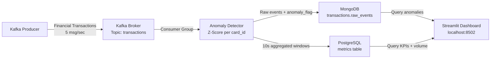

# Real-Time Streaming Analytics & Anomaly Detection Engine

A production-style data pipeline that detects fraudulent financial transactions in real time using Apache Kafka, z-score statistical analysis, and a live Streamlit dashboard — replacing the 24-hour latency of traditional batch fraud reports with sub-second flagging.

---

## Features

- **Real-time ingestion** — a Kafka producer streams ~5 synthetic transactions/sec from a fixed 100-card pool across 10 merchant categories.
- **Per-card anomaly detection** — a sliding-window z-score is computed per `card_id`, so a card's own spending history defines what counts as unusual (far fewer false positives than a global threshold).
- **Dual storage** — raw enriched events land in MongoDB (write-heavy, schema-flexible) while 10-second aggregated rollups go to PostgreSQL (structured, queryable).
- **Live dashboard** — a Streamlit app shows KPIs, a transaction-volume chart with anomaly markers, a per-category breakdown, and a recent-anomalies table, auto-refreshing on a configurable interval.
- **Resilient by design** — every service retries its dependencies until they're ready, malformed messages are skipped rather than crashing the consumer, dropped database connections are transparently re-established, and all services shut down gracefully on `SIGTERM`.
- **One-command startup** — `docker compose up` brings up all seven services with health-check-gated ordering.

---

## Business Context

Traditional fraud detection runs as a nightly batch job: transactions are processed once per day, meaning a fraudulent card can be used freely for up to 24 hours before anyone notices. This system eliminates that window.

| Approach | Detection Latency | Storage Pattern |
|---|---|---|
| Nightly batch report | ~24 hours | Data warehouse |
| **This system** | **< 1 second** | Kafka → MongoDB + PostgreSQL |

Every transaction is evaluated against that card's recent history the moment it arrives. Anomalies are flagged, stored, and surfaced on the dashboard within seconds.

---

## Architecture



**Data flow:**
1. Producer generates realistic transactions (normally distributed amounts, 10 merchant categories, 100-card pool)
2. Every 50th transaction is an injected anomaly (amount $500–$2000) to simulate fraud
3. Consumer reads from Kafka, calculates per-card z-score using a sliding window, writes enriched events to MongoDB
4. Every 10 seconds, consumer aggregates the window and upserts a row into PostgreSQL
5. Dashboard polls both databases and auto-refreshes at a configurable interval

---

## Tech Stack & Justifications

| Technology | Role | Why |
|---|---|---|
| **Apache Kafka** | Message broker | Decouples producer from consumer; durable, replayable stream; handles traffic spikes |
| **MongoDB** | Raw event store | Schema-flexible for evolving transaction fields; optimized for high-throughput inserts; compound indexes on `(anomaly_flag, timestamp)` for dashboard queries |
| **PostgreSQL** | Metrics store | ACID compliance for aggregated windows; `JSONB` column for category breakdowns; SQL makes ad-hoc analysis easy |
| **Streamlit** | Dashboard | Python-native; `@st.cache_resource` and `@st.cache_data` manage live DB connections cleanly |
| **Docker Compose** | Orchestration | Reproducible seven-service environment in one command; `condition: service_healthy` ensures correct startup order |

---

## Quickstart

**Prerequisites:** Docker Desktop

```bash
git clone https://github.com/Rawdamm/real-time-streaming-analytics.git
cd real-time-streaming-analytics
docker-compose up -d
```

Wait ~30 seconds for all services to pass their health checks, then open [http://localhost:8502](http://localhost:8502).

> The dashboard listens on container port `8501` but is published on host port **8502** (see `docker-compose.yml`) to avoid clashing with any Streamlit app you may already be running locally.

**Check logs:**
```bash
# Watch the producer send transactions
docker-compose logs -f producer

# Watch the consumer flag anomalies in real time
docker-compose logs -f consumer | grep ANOMALY
```

**Verify data in each store:**
```bash
# MongoDB: raw event count
docker-compose exec mongodb mongosh --eval \
  "db.getSiblingDB('transactions').raw_events.countDocuments()"

# PostgreSQL: aggregated metrics rows
docker-compose exec postgresql psql -U postgres -d transactions \
  -c "SELECT COUNT(*), MAX(anomaly_rate) FROM metrics;"

# Kafka: confirm topic exists and messages are flowing
docker-compose exec kafka kafka-topics \
  --list --bootstrap-server localhost:9092
```

**Tear down:**
```bash
docker-compose down -v
```

---

## Environment Variables

The Docker Compose file injects sensible defaults, so the stack runs with no configuration. Override any of these via the service `environment:` block or a `.env` file (copy `.env.example` to `.env` to start). Each Python service also falls back to the same defaults when run outside Docker.

| Variable | Used by | Default | Description |
|---|---|---|---|
| `KAFKA_BROKER` | producer, consumer | `kafka:9092` | Kafka bootstrap server `host:port` |
| `MONGO_URI` | consumer, dashboard | `mongodb://mongodb:27017` | MongoDB connection string for raw events |
| `PG_HOST` | consumer, dashboard | `postgresql` | PostgreSQL host |
| `PG_PORT` | consumer, dashboard | `5432` | PostgreSQL port (inside the Docker network; published on `5433` to the host) |
| `PG_DB` | consumer, dashboard | `transactions` | PostgreSQL database name |
| `PG_USER` | consumer, dashboard | `postgres` | PostgreSQL user |
| `PG_PASSWORD` | consumer, dashboard | `postgres` | PostgreSQL password |

> **Ports as seen from your host:** dashboard `8502`, Kafka `9092`, MongoDB `27017`, PostgreSQL `5433`.

---

## Project Structure

```
real-time-streaming-analytics/
├── src/
│   ├── producer.py       # Kafka producer — generates 5 transactions/sec from a 100-card pool
│   ├── consumer.py       # Anomaly detector — sliding-window z-score, dual storage, MongoDB indexes
│   └── dashboard.py      # Streamlit dashboard — KPIs, volume chart, category breakdown, anomaly table
├── docker-compose.yml    # Seven-service orchestration with health checks
├── Dockerfile            # python:3.11-slim image for all Python services
├── requirements.txt      # Pinned Python dependencies
├── startup.sh            # Entrypoint — polls service readiness before starting
├── init.sql              # PostgreSQL schema (TIMESTAMPTZ, JSONB, index)
├── .env.example          # Environment variable template
└── README.md
```

---

## Design Decisions

### Z-Score Anomaly Detection

The consumer maintains a sliding window of the last 20 transaction amounts **per card**. For each new transaction:

```
z = (amount − window_mean) / window_sample_std_dev
```

If `z > 3`, the transaction is flagged. This corresponds to the 99.7% confidence interval (3-sigma rule) — amounts that occur less than 0.3% of the time relative to that card's own history.

Sample standard deviation (ddof=1) is used rather than population standard deviation because the sliding window is a sample of the card's true spending distribution, making the unbiased estimator the statistically correct choice.

**Why per-card rather than global?** A $500 transaction is normal for a business traveler but extreme for a grocery-only card. Per-card windows capture individual spending patterns, dramatically reducing false positives.

**Minimum window of 3:** With fewer than 3 data points, the standard deviation is unreliable. The consumer skips anomaly detection until enough history exists for a given card.

**Fixed card pool:** The producer draws from a pre-defined pool of 100 cards rather than generating random IDs. At 5 msg/sec across 100 cards, each card receives roughly one transaction every 20 seconds — the minimum window fills in ~60 seconds and the full 20-sample window in ~7 minutes, matching realistic detection timelines.

### Dual Storage Pattern

| Store | Query Pattern | Why |
|---|---|---|
| MongoDB | Write-heavy, flexible schema | Raw events arrive at 5/sec; compound indexes on `(anomaly_flag, timestamp)` and `card_id` keep dashboard queries fast; adding new fields requires no migration |
| PostgreSQL | Read-heavy, structured aggregations | 10-second rollups fit naturally into a relational table; `JSONB` column for category breakdowns enables native JSON operators; SQL dashboards work natively |

### Tumbling vs Sliding Metrics Windows

The 10-second PostgreSQL windows are **tumbling** (non-overlapping). Each window captures a clean snapshot: `total_transactions`, `anomaly_rate`, `merchant_category_breakdown`. This keeps the metrics table small and aggregation logic simple, while still providing near-real-time granularity.

### Health-Check Startup Ordering

All infrastructure services (Zookeeper, Kafka, MongoDB, PostgreSQL) expose Docker health checks. The Python services use `depends_on: condition: service_healthy`, so they never start against a half-initialised broker or database. `startup.sh` adds a second layer of readiness polling inside the container for additional resilience.

### Kafka Consumer Group

Using `group_id='anomaly-detection-group'` means Kafka tracks the consumer's offset. If the consumer restarts, it resumes from where it left off rather than reprocessing all messages — important for production reliability.

---

## Testing & Validation

After running for ~5 minutes (1500 transactions at 5/sec), you should see:

- ~30 anomalies in the dashboard table (one per 50 transactions)
- PostgreSQL: ~30 rows in `metrics` (one per 10-second window)
- MongoDB: ~1500 documents in `raw_events`

**Manual verification:**
```bash
# Should show ~30 anomalies
docker-compose exec mongodb mongosh --eval \
  "db.getSiblingDB('transactions').raw_events.countDocuments({anomaly_flag: true})"

# Check z-scores of detected anomalies (should be >> 3)
docker-compose logs consumer 2>&1 | grep ANOMALY | tail -10

# Verify category breakdown JSONB is being populated
docker-compose exec postgresql psql -U postgres -d transactions \
  -c "SELECT merchant_category_breakdown FROM metrics ORDER BY aggregation_time DESC LIMIT 1;"
```

---

## Troubleshooting

**Dashboard shows "connection failed":** Services may still be initialising. Wait 30 seconds and refresh — Docker health checks ensure the pipeline starts in order, but the dashboard retries automatically.

**No anomalies appearing:** The z-score window requires at least 3 transactions per card before flagging begins. With 100 cards at 5 msg/sec, detection starts ~60 seconds after launch. Check `docker-compose logs consumer | grep ANOMALY`.

**Kafka consumer lag:** Run `docker-compose exec kafka kafka-consumer-groups --bootstrap-server localhost:9092 --describe --group anomaly-detection-group` to inspect offset lag.

---

## Future Enhancements

- **Adaptive thresholds:** Learn the z-score cutoff from historical false-positive rates rather than hardcoding `z > 3`
- **Isolation Forest:** Complement z-score with an unsupervised ML model for multi-dimensional anomaly detection (amount + time-of-day + merchant category)
- **Alerting:** Publish high-severity anomalies to a Slack webhook or PagerDuty in real time
- **dbt models:** Add a transformation layer on top of PostgreSQL for analytical queries (rolling 1-hour windows, card-level risk scores)
- **Schema Registry:** Enforce Avro/Protobuf message contracts via Confluent Schema Registry as the pipeline scales

---

## What I Learned

- **Kafka fundamentals:** Producer/consumer model, consumer groups, offset management, `acks="all"` for durability
- **Dual-storage pattern:** Optimising each store for its actual query pattern rather than forcing one database to do everything
- **Statistical anomaly detection:** Sample vs. population standard deviation; why per-entity windows outperform global thresholds for fraud detection
- **Streamlit for live data:** `@st.cache_resource` for connection pooling, `@st.cache_data(ttl=5)` for query-result caching, `st.rerun()` for auto-refresh
- **Docker Compose production patterns:** Pinned image versions, health-check conditions, startup ordering, environment variable management

---

## License

MIT License. Built for portfolio — June 2026.
